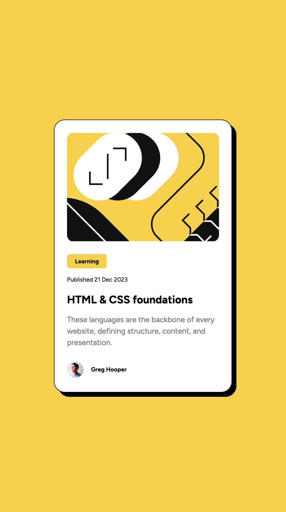

### Screenshot

### Built with

- Semantic HTML5 markup
- CSS custom properties
- Flexbox

### What I learned

I decided to build a simple project as a practice to implement correct HTML semantics for accessibility. I hope I have achieved that goal. The more I learn about accessibility and its impact on users such as those using screen readers, the blind, and the deaf blind, the more intentional I become in how I build web pages. There's a lot to learn and I am committed to keep learning! 😊
